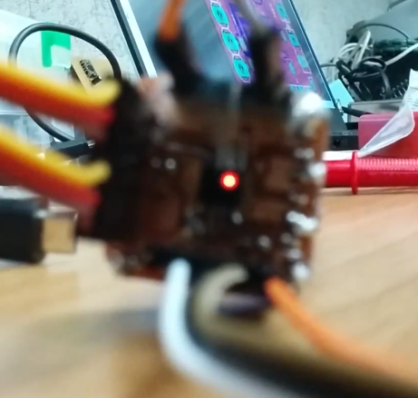
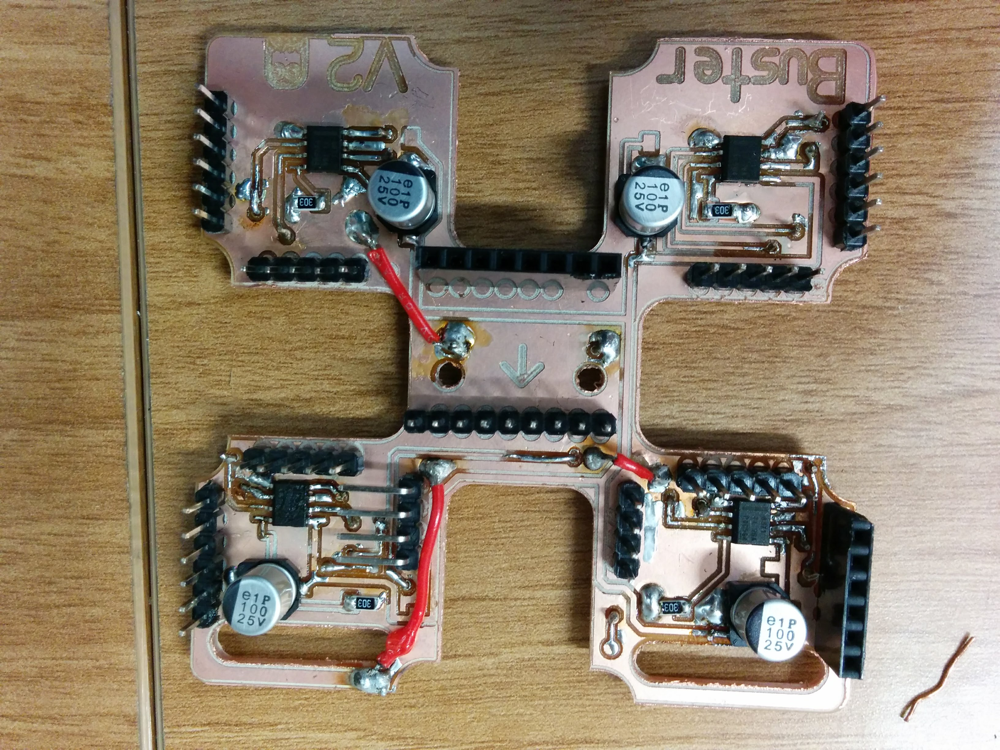

### Boards:

PCBs used (or designed for) [PacBot](https://harvardrobotics.com/pacbots/).

Tests:

- MC-test
    + A feature filled breakout board for the DRV8871 (doesn't work).
    + 

- MC-test-simple
    + Simplified barebones breakout board for the DRV8871, does work.

Robot:

- S0: Stage 0 PCB
    + Has shiny (16 APA102s), 2 voltage regulators (TPS76801QD), 2 ADCs (ADS1000), battery leads, an enable jumper, and passthrough pins for I2C, 5V, battery power, and SPI (CLK/MOSI).

- S0R: Stage 0 PCB, reduced
    + Same as above minus one voltage regulator and the enable jumper.
    + This board was tested; it likely has some cap ESR issues.

- S1: Stage 1 PCB
    + 4 Motor Drivers (DRV8871s), IMU (MPU-6050), Pololu Encoder module passthrough, and two I2C bus passthrough.
    + Janky but functional.
    + 

- Stage2_V2
    + 4 Distance Sensors + EN pin (VL6180Xs), an RPi Zero W, and 4 Motor PWM output pairs, 4 Quadrature Encoder inputs, 2 I2C Bus inputs, 1 SPI input (CLK/MOSI), 1 MPU interrupt pin, and assorted power connectors.
    + Not finished or routed, but a valiant effort regardless.

